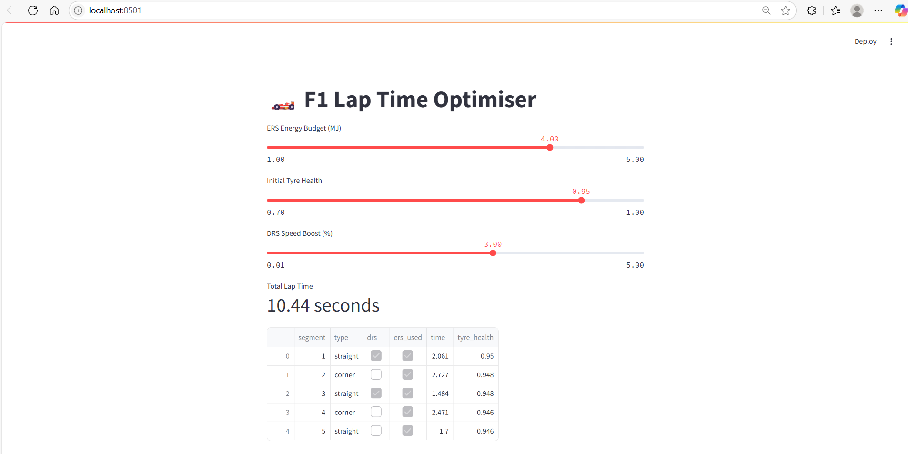
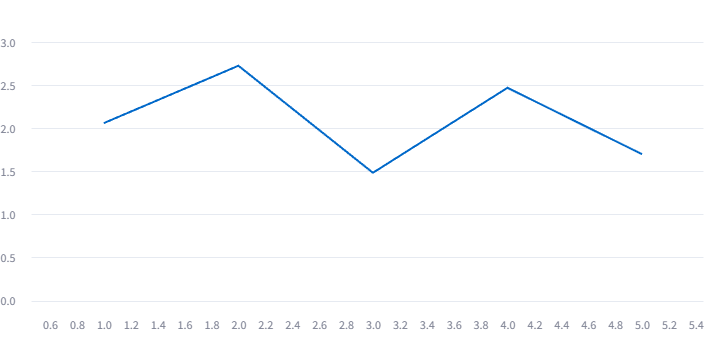

# 🏎️ F1 Lap Time Optimiser: ERS + DRS + Tyre Degradation Simulation

This project is a simplified simulation of an F1 car's lap dynamics built in Python. It models the effects of:
- **Hybrid system deployment (ERS)**
- **DRS speed boost in valid zones**
- **Tyre degradation over the lap**
- **Lap time telemetry export**
- **Interactive GUI via Streamlit**

Built as a showcase for vehicle performance engineering roles, especially in the context of Formula 1.

---

## 🚀 Features

- 🧮 **Segment-based Lap Simulation**
- ⚡ **ERS Deployment Strategy (5% time gain when used)**
- 🪶 **DRS Zones (Speed Boost on Straights)**
- 🛞 **Tyre Wear Modelling (Affects Corners More)**
- 📊 **Lap Time Chart and CSV Telemetry**
- 🖥️ **Streamlit GUI for Interactive Use**

---

## 📸 Screenshots

## 📸 Streamlit UI

| Lap Config Panel | Lap Time Chart |
|------------------|----------------|
|  |  |

---

## 🛠️ Project Structure

f1-lap-time-optimiser/
├── main.py                  # Console-based simulation script
├── ui_streamlit.py          # Streamlit web app interface
├── utils.py                 # Simulation logic: ERS, DRS, tyre degradation
├── data/
│   └── lap_telemetry.csv    # Output telemetry file (ignored by Git)
├── assets/
│   ├── config.png           # UI screenshot: sliders + table
│   └── chart.png            # UI screenshot: segment time chart
├── .gitignore               # Ignore data and temp files
└── README.md                # GitHub-facing documentation
